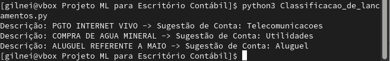

# Machine Learning na Contabilidade: Classificação Automática de Lançamentos

Este repositório apresenta um caso de estudo prático sobre a aplicação de Inteligência Artificial para otimizar processos em escritórios de contabilidade, utilizando a linguagem **Python**. Na minha pós-graduação, estou cursando a matéria de Inteligência Artificial aplicada à otimização contábil, que é apenas uma das muitas aplicações da IA na área.

## 📌 O Problema
Escritórios de contabilidade lidam com grandes volumes de extratos bancários e notas fiscais. A classificação manual de cada lançamento em contas contábeis (ex: Luz, Aluguel, Internet) é uma tarefa repetitiva, lenta e sujeita a erros operacionais.

## 🚀 A Solução
Desenvolvimento de um modelo de **Processamento de Linguagem Natural (NLP)** e **Machine Learning** que aprende com o histórico de lançamentos do escritório para sugerir automaticamente a conta contábil de novos registros.

### Tecnologias Utilizadas:
* **Python 3.x**
* **Pandas**: Manipulação de dados.
* **Scikit-Learn**: Criação do Pipeline de ML, vetorização de texto e algoritmo *Random Forest*.

## 🛠️ Como Funciona
O script utiliza um `Pipeline` que combina duas etapas principais:
1.  **CountVectorizer**: Transforma as descrições dos lançamentos (texto) em vetores numéricos.
2.  **Random Forest Classifier**: Um algoritmo de aprendizado supervisionado que classifica o vetor na categoria contábil correspondente com base no padrão aprendido.

## 📊 Exemplo de Resultado
Ao receber uma descrição como `"PGTO INTERNET VIVO"`, o modelo identifica o padrão e sugere a conta: `Telecomunicações`.

## 📈 Próximos Passos (Roadmap)
- [ ] Implementar detecção de anomalias para auditoria digital.
- [ ] Criar uma interface simples (Streamlit) para upload de arquivos Excel/CSV.
- [ ] Integrar com APIs de bancos para leitura de extratos em tempo real.

## 🔗 Conecte-se

